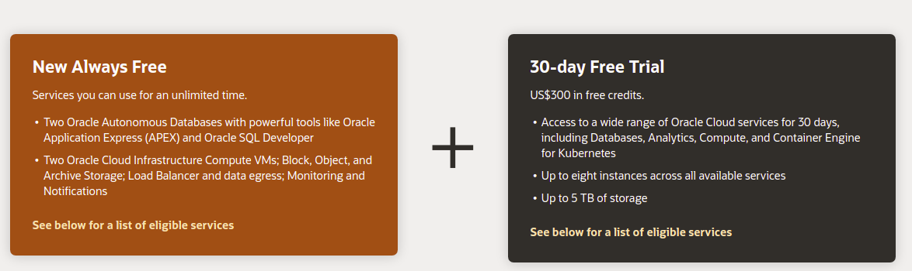

# Chapter: Prateek Shaw sp20-516-229

## Data Science : Oracle

Data Science is a platform for data scientists to build, train, and manage models on Oracle Cloud Infrastructure using Python and open source machine learning libraries.It also offers below Oracle ML product.

* Oracle Labs Auto ML
* Model Explanation Tools
* Notebook
* Oracle Accelerated Data Science SDK

## Creating Oracle Free Tier Account 

Oracle Cloud Free Tier allows you to sign up for an Oracle Cloud account which provides a number of Always Free services and a Free Trial with US$300 of free credit to use on all eligible Oracle Cloud Infrastructure services for up to 30 days. The Always Free services are available for an unlimited period of time. The Free Trial services may be used until your US$300 of free credits are consumed or the 30 days has expired, whichever comes first.

{#fig:sp20-516-229-oracle-1}

{#fig:sp20-516-229-oracle-2}

