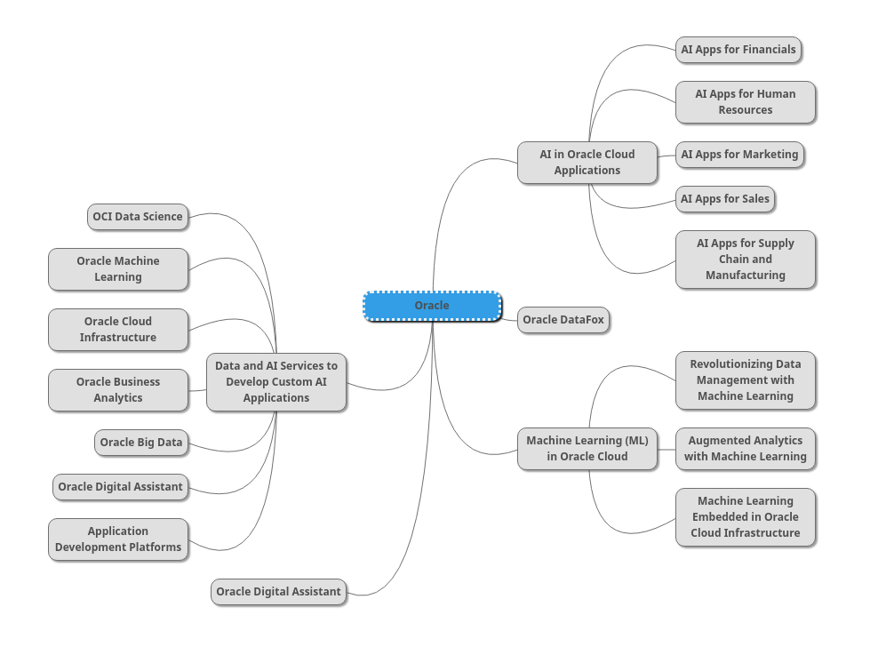

# AI Services on Oracle: Prateek Shaw sp20-516-229

## Oracle Cloud Introduction

Oracle Cloud [@www-oracle-cloud-intro-sp20-516-229] is a cloud computing service offered by Oracle Corporation providing servers, storage, network, applications and services through a global network of Oracle Corporation managed data centers. The company allows these services to be provisioned on demand over the Internet.In simple terms, cloud computing is renting instead of buying your IT. 

Rather than investing heavily in databases, software, and equipment, companies are opting to access their compute power via the internet and pay for it as they use it.

## AI Services on Oracle Cloud

Oracle AI Services as shown @fig:sp20-516-229-oracle-cloud-ai

{#fig:sp20-516-229-oracle-cloud-ai}

### Oracle AI Applications

Oracle offer in-build AI support in its Cloud based enterprise application.Below are list of application which support AI.

#### AI Apps for Financials 

Oracle Adaptive Intelligent (AI) Apps [@www-oc-ai-fin-sp20-516-229] for ERP is a suite of AI and data-driven features that help procurement and finance teams improve financial performance, optimize cash flow, and increase agility across payables, receivables, procurement, and inventory. link needed

This include inbuild support for supplier categorization and interllignet payment discounts. Below is product more information.

| Product Name             | Cost | Remark |
| ------------------- | ------- | ------------- |
| Oracle Adaptive Intelligent Apps for Enterprise Resource Planning  | $125.00  | Included(Supplier categorization and   Intelligent payment discounts) |

#### AI Apps for Human Resources 

In HCM apps is use for managing human resource.Oracle has inbuild addaptive intelligent inside this App which help customer to reduce time-to-hire, improve productivity and ensure compliance[@www-oc-ai-hr-sp20-516-229]. Below is product more informations. 

| Product Name             | Cost | Remark |
| ------------------- | ------- | ------------- |
| Oracle Adaptive Intelligent Apps for Human Capital Management  | $4.00 (employee/month)  | Included(Best Candidates and Stack-ranked applicants) |
| Oracle Advanced HCM Controls Cloud  | $3.00 (employee/month)  | * GDPR security analysis for all users * Payroll and payment fraud detection * Prebuilt templates for core audit analysis * Security analysis for configuration and maintenance * Visual workbench Dashboards with analytics, alerts, and reporting) |

#### AI Apps for Marketing  

Oracle has support for AI in B2B and B2C products [@www-oc-ai-marketing-sp20-516-229]. Below is product more information.

| Product Name             | Cost | Remark |
| ------------------- | ------- | ------------- |
| Oracle Adaptive Intelligent Apps for Customer Experience, Commerce and Marketing  | $1,000.00 (user/month) and $5.00 unit/1,000 interactions | Next-best offer and product recommendations Coordinated open-time content Intuitive search experiences Optimized marketing orchestrations Connected audiences |

#### AI Apps for Sales 

Oracle has incorporated intelligence inside the sales APP, using this customer can see Probability Scores, win the next big deal and they can focus account prioritization [@www-oc-ai-sales-sp20-516-229].Below is product more information.

| Product Name             | Cost | Remark |
| ------------------- | ------- | ------------- |
| Oracle Adaptive Intelligent Apps for Customer Experience, Sales and Service  | $50.00 (user/month) | Next-best sales action Win probability scores |

#### AI Apps for Supply Chain and Manufacturing 

This help manufacturing and supply chain managers significantly improve production yield, product quality, lead times, equipment, and labor efficiencies. Below is product more information. [@www-oc-ai-supply-sp20-516-229]

| Product Name             | Cost | Remark |
| ------------------- | ------- | ------------- |
| Oracle Adaptive Intelligence Apps for Manufacturing Cloud  | $100.00 (user/month)  | Factory command center Insights (patterns and correlations analysis) Predictive analysis Genealogy and traceability analysis |
| Oracle Adaptive Intelligence Apps Resource Capacity Cloud  | $950.00 additional resource capacity/month  |  |

### Data and AI Services to Develop Custom AI Applications

#### Oracle Data Science

Oracle Cloud Data Science Platform includes seven new services that deliver a comprehensive, end-to-end experience that accelerates and improves business decisions. [@www-oc-data-science-sp20-516-229] Below are services

1. Oracle Cloud Infrastructure Data Science
1. Oracle Machine Learning
1. Oracle Cloud Infrastructure Data Catalog
1. Oracle Big Data Service
1. Oracle Cloud SQL
1. Oracle Cloud Infrastructure Data Flow
1. Oracle Cloud Infrastructure Virtual Machines for Data Science

I have not found cost details for this service at Oracle.

#### Oracle Machine Learning

Oracle has moved all the machine-related components into the database. This allows the organization to develop the product rapidly.This is best of the oracle machine learning.[@www-oc-ml-sp20-516-229] As shown @fig:sp20-516-229-oc-ml-approch

![Oracle Machine Learning Platform[www-oc-ml-approch-sp20-516-229]](images/sp229-oc-ml-approch.png){#fig:sp20-516-229-oc-ml-approch}

I have not found cost details for this service at Oracle.

